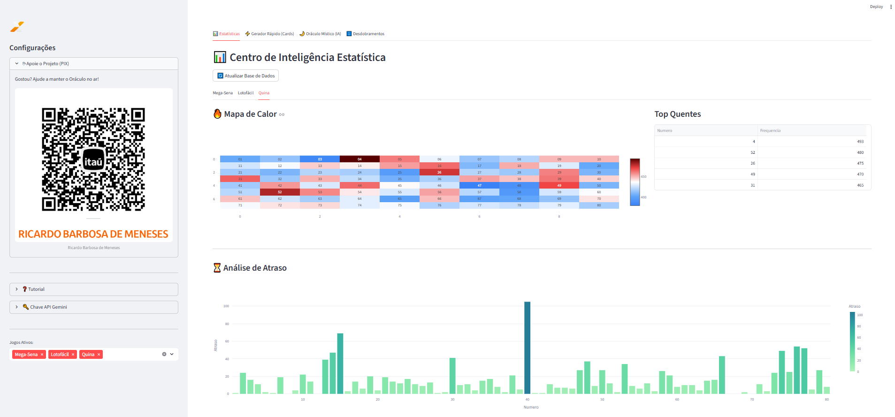
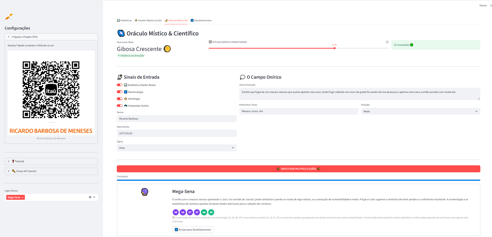
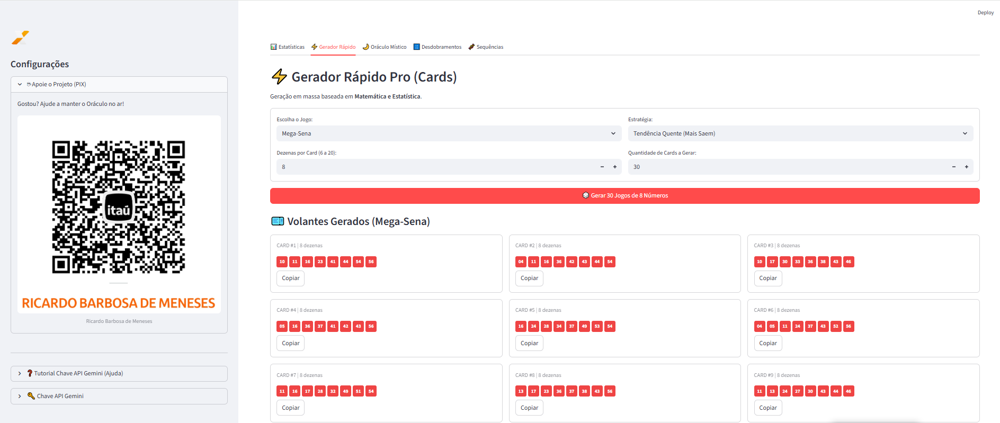
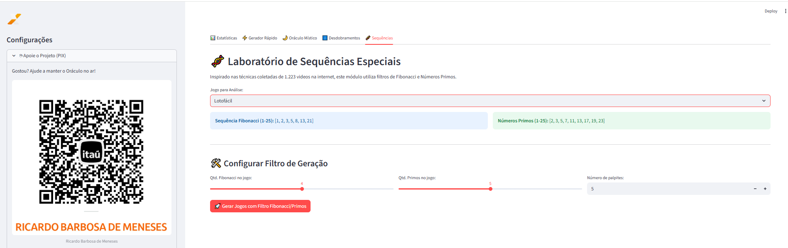
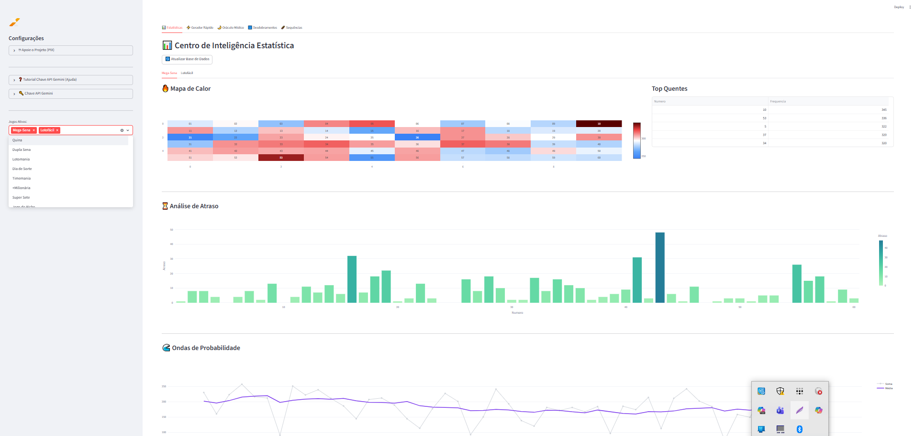
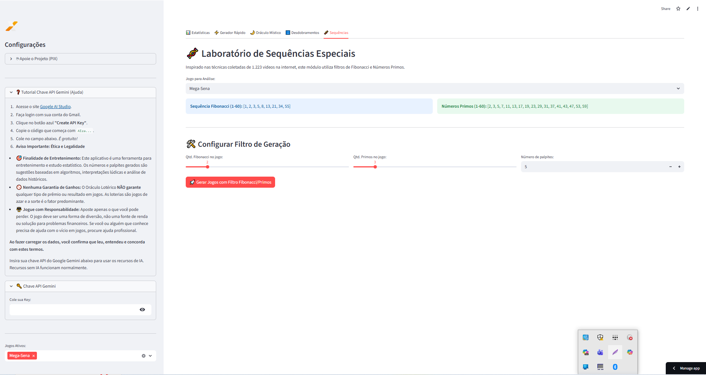
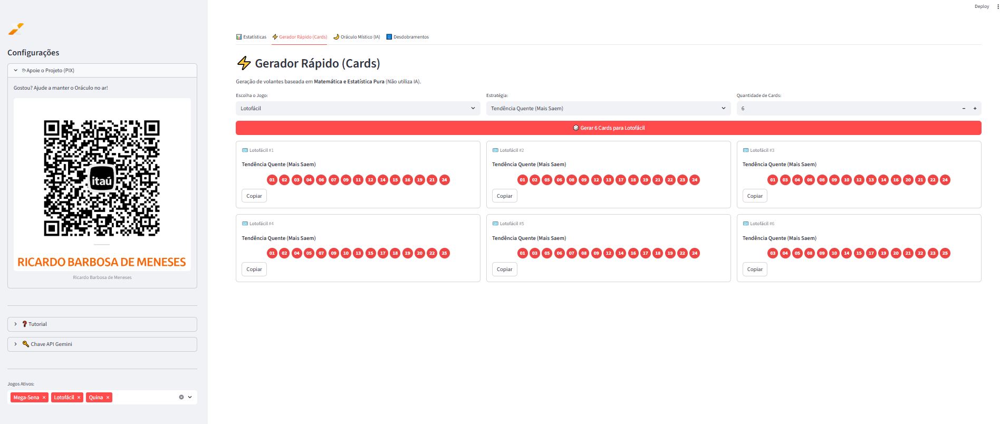
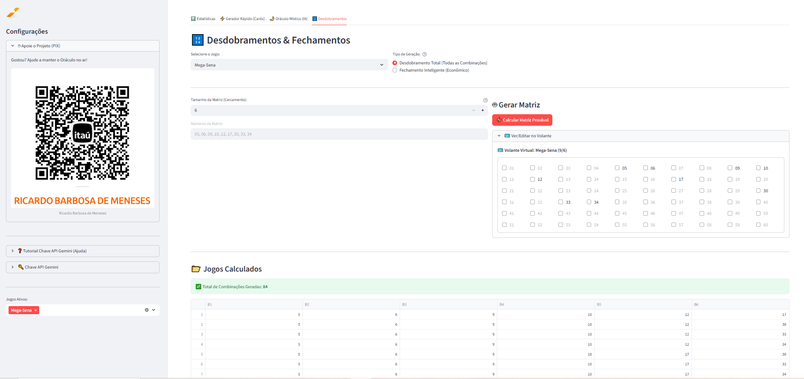

# 🔮 Oráculo Ultimate: Análise Lotérica & Interpretação de Sonhos com IA

> **Uma fusão entre Ciência de Dados, Misticismo e Inteligência Artificial.**
https://oraculo-loterico-ia.streamlit.app/
O **Oráculo Ultimate** é uma aplicação web desenvolvida em Python e Streamlit que oferece ferramentas avançadas para entusiastas de loterias. O projeto combina análise estatística rigorosa (mapas de calor, atrasos, tendências) com interpretações lúdicas e místicas (sonhos, numerologia) alimentadas pela **Google Gemini AI**.

---

## 📸 Screenshots

| Painel Estatístico | Oráculo Místico (IA) |
|:---:|:---:|
|  |  |
|  |  |
|  |  |
| **Gerador de Cards** | **Desdobramentos** |
|  |  |

---

## ✨ Funcionalidades Principais

### 1. 📊 Centro de Inteligência Estatística
Ferramentas visuais para análise de dados históricos da Caixa:
* **Mapa de Calor (Heatmap):** Visualização gráfica da frequência das dezenas.
* **Análise de Atraso:** Gráfico de barras mostrando há quantos concursos uma dezena não sai.
* **Ondas de Probabilidade:** Gráfico de linha comparando Soma vs. Média Móvel dos sorteios.
* **Top Quentes:** Lista automática das dezenas mais frequentes.

### 2. 🌌 Oráculo Místico & Científico (Powered by Gemini AI)
Utiliza a API do Google Gemini para fundir dados pessoais e oníricos:
* **Interpretação de Sonhos:** O usuário descreve um sonho e a IA extrai o contexto, sentimentos e sugere números correlacionados.
* **Numerologia & Astrologia:** Gera números da sorte baseados no nome, data de nascimento e signo.
* **Fusão de Dados:** O algoritmo cruza os palpites místicos com os dados estatísticos (números quentes) para gerar o palpite final.
* **Suporte ao Jogo do Bicho:** IA atua como "Bicheiro Virtual", interpretando sonhos e sugerindo Bicho, Grupo, Dezena, Centena e Milhar.

### 3. ⚡ Gerador Rápido (Cards)
Geração instantânea de volantes baseada em matemática pura (sem IA):
* **Estratégias:** Surpresinha (Aleatório), Tendência Quente (Mais saem), Tendência Fria (Atrasados) e Equilibrada.
* **Visualização:** Layout em "cards" com botão de cópia rápida.

### 4. 🔢 Desdobramentos & Fechamentos
Ferramenta matemática para criação de jogos:
* **Matriz de Cercamento:** Gera combinações baseadas em uma quantidade maior de números selecionados.
* **Volante Virtual:** Interface interativa para seleção manual de números.
* **Exportação:** Gera planilha `.csv` com todos os jogos calculados pronto para download.
* **Sugestão via IA:** A IA pode sugerir a melhor matriz baseada no histórico recente.

---

## 🎮 Jogos Suportados
O sistema suporta a atualização de dados e geração de palpites para:
* Mega-Sena
* Lotofácil
* Quina
* Lotomania
* Dupla Sena
* Dia de Sorte
* Timemania
* +Milionária
* Super Sete
* Jogo do Bicho (Modo Místico Especial)

---

## 🛠️ Tecnologias Utilizadas

* **Linguagem:** [Python 3.x](https://www.python.org/)
* **Frontend/Framework:** [Streamlit](https://streamlit.io/)
* **Análise de Dados:** Pandas, NumPy
* **Visualização:** Plotly Express, Plotly Graph Objects
* **Inteligência Artificial:** [Google Gemini API](https://ai.google.dev/) (`requests`)
* **API de Dados:** Integração com API de Loterias (Heroku)

---

## 🚀 Como Executar

### Pré-requisitos
* Python instalado.
* Uma chave de API do Google Gemini (Gratuita no Google AI Studio).

### Instalação

1.  Clone o repositório:
    ```bash
    git clone [https://github.com/seu-usuario/oraculo-loterico.git](https://github.com/seu-usuario/oraculo-loterico.git)
    cd oraculo-loterico
    ```

2.  Crie um ambiente virtual (opcional, mas recomendado):
    ```bash
    python -m venv venv
    source venv/bin/activate  # Linux/Mac
    venv\Scripts\activate     # Windows
    ```

3.  Instale as dependências:
    ```bash
    pip install streamlit pandas numpy plotly requests
    ```

4.  Execute a aplicação:
    ```bash
    streamlit run oraculo_dos_sonhos_lotericos_6.1.py
    ```

---

## 🔑 Configuração da API Key
Para utilizar as funcionalidades de **Sonhos** e **Sugestões Inteligentes**, você precisa de uma chave API do Google:

1.  Acesse o [Google AI Studio](https://aistudio.google.com/app/apikey).
2.  Crie uma nova API Key.
3.  No aplicativo, abra a barra lateral esquerda, expanda "Chave API Gemini" e cole sua chave.
    * *Nota: O app funciona parcialmente (apenas estatísticas e gerador matemático) sem a chave.*

---

## ⚠️ Aviso Legal (Disclaimer)

* **Finalidade de Entretenimento:** Este aplicativo é uma ferramenta para estudo estatístico e entretenimento.
* **Sem Garantias:** O Oráculo Lotérico **NÃO garante** acertos, prêmios ou lucros. Loterias são jogos de azar onde a probabilidade matemática prevalece.
* **Jogo Responsável:** Aposte apenas o que pode perder. O jogo não é solução para problemas financeiros.

---

## 📝 Autor

Desenvolvido por **Ricardo Barbosa de Meneses**.

---

*Gostou do projeto? Considere apoiar através do PIX indicado na barra lateral do aplicativo!* ☕
